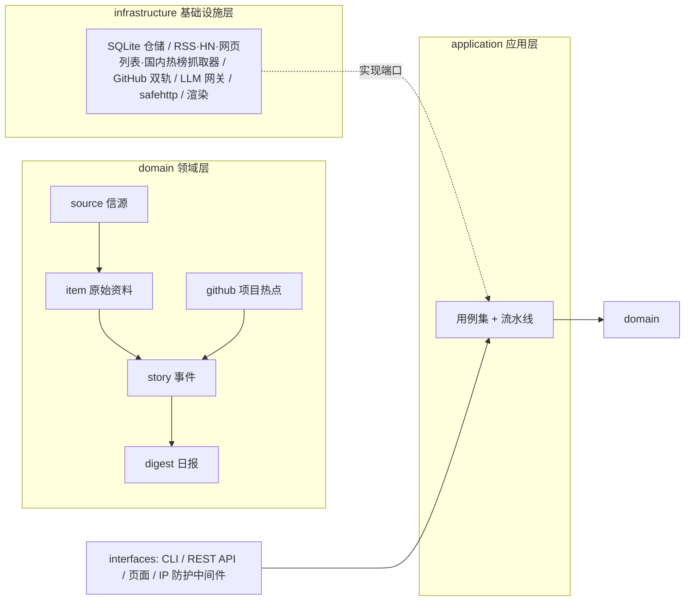

# 架构设计（DDD）

本文记录 GithubHot 的领域划分、依赖规则与两个热度公式的推导。
对应代码：`internal/`（领域 → 应用 → 基础设施 → 接口，依赖严格向内）。

## 1. 限界上下文



| 上下文 | 聚合根 | 关键不变量 |
|---|---|---|
| source | Source | 信源分级（T1 官方一手 / T2 媒体个人）决定评分门槛与热度权重 |
| item | Item | ID = URL 归一化 SHA-256，天然判重；精选状态机单向推进 |
| github | Project | 热度只看窗口内 star 增量（快照差分），重复抓取不虚增 |
| story | Story | 热度按独立来源计（信源 ID + 域名去重）；成员并集合并 |
| digest | Digest | 日期（东八区自然日）即身份，一天一份 |

## 2. 精选流水线（LLM 必选）

```
信源到期 → 并发抓取（worker pool） → 判重入库
       → 预筛（批量，LLM 判值得不值得看）
       → 双评分（同一份评分标准，模型A/模型B 独立各评一次；
                 均分 ≥ 分级门槛 且 双方 ≥4 才通过）
       → 中文写作（标题 ≤30 字、答案先行摘要、推荐理由、标签）
       → 聚簇（向量/词面召回候选 → LLM 裁决 sameEvent/followUp，
               置信度 <0.6 不合并——宁拆错不合并错）
       → 融合链接（资讯 × 项目互相印证，置信度 ≥0.7 才建立）
       → 热度重算 + 历史落库 → 三榜视图 → 日报
```

每一步的提示词原文都在 `internal/domain/prompts/prompts.go`——这是精选标准的
KnowHow，改标准不改代码（与 AIHOT 的 `industry/prompts/` 同等地位）。
防幻觉底线写进 system prompt：材料里没有的信息一个字都不能编。

## 2.5 国内热榜轻管道（不走 LLM）

`hot_board` 信源（百度 / 微博 / 网易新闻榜 / 腾讯新闻榜 + 榜单型 RSS）走一条
独立轻管道：直连抓取（国内无需代理）→ 按标题相似度聚簇 → 多源共振热度
（同一话题被越多榜单报道、报道越新鲜排名越高）→ 榜单页 `/domestic` 与
`GET /api/v1/hot/domestic`。LLM 在这条线上只做一件事：每天一篇中文综述
（`domestic_summary_enabled` 可关，按数据新鲜度自动重刷）。
单个榜单源失效按指数退避自动降频，不影响其余源。

## 3. 两个热度公式

### AI 资讯事件（story.Hotness）

```
H = Σ(每个独立来源 w(分级) × 0.5^(年龄小时/24)) × 10 × fusion
```

- **独立来源**：按（信源 ID, 域名）去重。官网发一篇、媒体转十篇、X 上吵一天，
  读者只需要看到一次；一家媒体发十篇也只算一次。
- **时间**：48 小时窗口之外不贡献（保底不为 0，避免事件凭空消失）；
  24 小时权重减半。
- **分级**：T1 = 1.0，T2 = 0.6。官方一手信源即使写得克制也值得看。
- **fusion**：与 GitHub 项目互证 ×1.25——两个世界同时说一件事，可信度更高。

### GitHub 项目（github.Hotness）

```
H = 10 × log2(1 + 24h新增star) + trending加成 + 新爆加成
```

- **增量而非存量**：300 star 的新项目比静态 30 万 star 的老项目更热；
  对数抑制头部碾压。
- **快照差分**：每次观测落一张（full_name, at, stars, trending_rank）快照，
  增量 = 现在减窗口内最早观测。重复抓取不虚增（有单测锁定）。
- **trending 加成**：1-3 名 +6、4-10 名 +3、11-25 名 +1（社区口径的补充信号）。
- **新爆加成**：首次发现不足 24h 且有增长 +5。

## 4. 双轨发现与降级

- 轨道 A（官方 Search API）：`created:>N天 stars:>M`，按 star 排序——口径稳定、有配额保障；
- 轨道 B（trending 页）：社区每日榜——页面结构变化即失败；
  失败时自动降级为仅轨道 A（日志提示，不中断流水线）。
  trending 页不含绝对 star 数，逐仓调用 REST 补全。

## 5. 安全边界

- **SSRF 防护**（`infrastructure/safehttp`）：所有出站请求的唯一通道。
  仅允许 http/https；拒绝 localhost / *.local / *.internal / 云元数据主机名；
  IP 字面量按段拒绝（环回、私有、CGNAT、TEST-NET、保留段）；
  域名先 DNS 解析、解析结果全为公网地址才放行。因此自建内网 LLM 端点不可用（有意为之）。
- **SQL**：全部参数化查询；DDL 为内联字面量。
- **CORS**：白名单来自 `CORS_ORIGINS`，默认不开放跨域。
- **响应体上限** 10MB；请求超时 30s。
- **管理端鉴权**（`interfaces/httpapi/auth.go`）：三种模式按 `.env` 自动切换——
  `ADMIN_PASSWORD_HASH`（Argon2id 哈希 + 服务端会话 Cookie，推荐；
  `githubhot admin hash` 生成）→ `ADMIN_TOKEN`（请求头）→ 均未配置则开发模式放行。
- **三层 IP 防护**（`interfaces/httpapi/ipguard.go`）：入口中间件按请求档案
  （IP 记忆 / 行为节奏 / WebRTC + Canvas·WebGL·字体等设备指纹环境核验）累计违规计分，
  超阈值自动阶梯封禁（指数退避间隔），封禁访客直接 404；管理端 `/admin/ipguard`
  面板可查看 Top 访客、按时间筛选、单 IP 下钻全部指纹与事件、手动封禁/解封。
  开关见 `IP_GUARD_ENABLED` / `IP_GUARD_LOCAL` / `IP_GUARD_SECRET`。

## 6. 为手机 APP 预留的契约

- REST API 全部挂在 `/api/v1/*`，JSON 结构即 `application.HotView` 及各 Row 的
  JSON 标签——客户端代码生成（如 Flutter json_serializable）可直接引用；
- CORS 白名单支撑 Web 客户端；原生 APP 不依赖 CORS；
- 静态产物：`data/site/index.html`（三榜页）与 `data/digests/*.md`（日报）可托管到
  Pages / CDN，APP 内嵌 WebView 或直接拉 JSON 均可；
- 若未来需要端侧离线逻辑，`internal/domain` 不依赖 IO，可经 gomobile 编译为
  Android/iOS 库复用热度计算与领域模型。

## 7. 测试策略

- 领域单测：两个热度公式（窗口、衰减、去重、融合加成、快照不虚增）、
  词面/向量相似度、URL 归一化判重——全部纯函数、确定性断言；
- 基础设施单测：SSRF 校验矩阵（22 个拒绝/放行用例）、trending HTML 解析夹具；
- 端到端（`application/pipeline_test.go`）：假 fetcher + 假 LLM + 假 GitHub +
  内存仓储跑完整流水线，锁定验收行为：广告淘汰、双评分门槛、同事件合并、
  双轨去重合并、跨日差分、融合加成、日报内容。
